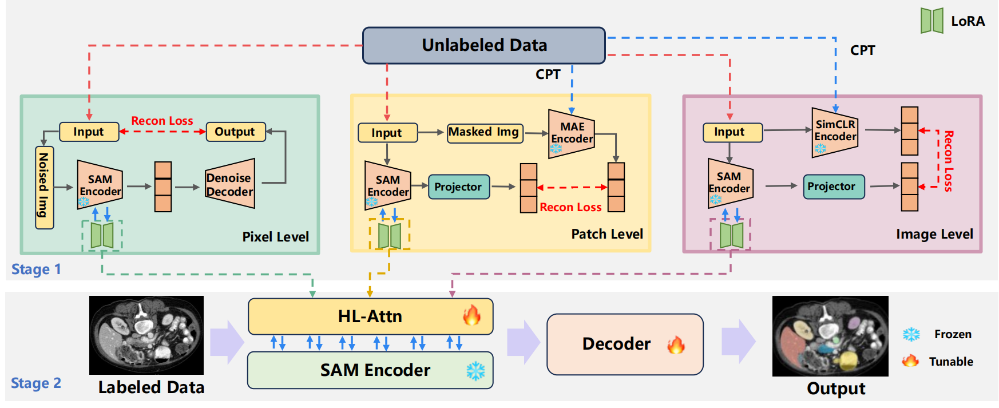

# SAMora 

<b>SAMora: Enhancing SAM through Hierarchical Self-Supervised
Pre-Training for Medical Images</b> <br/>
[Shuhang Chen](https://scholar.google.com/citations?user=tt0czd0AAAAJ&hl=zh-CN), [Hangjie Yuan](https://scholar.google.com/citations?user=jQ3bFDMAAAAJ&hl=en), [Yunqiu Xu](https://scholar.google.com/citations?user=SdJX4nAAAAAJ&hl=zh-CN), [Pengwei Liu](https://scholar.google.com/citations?user=mlcLvUEAAAAJ&hl=zh-CN), [Tao Feng](https://datascience.hku.hk/people/liangqiong-qu/), [Zeying Huang](https://swsamleo.github.io/wei_shao.github.io/), and [Yi Yang](https://scholar.google.com/citations?user=RMSuNFwAAAAJ&hl=en) <br/>
ICCV 2025 <br/>

[paper](https://arxiv.org/abs/2511.08626) | [code](https://github.com/ShChen233/SAMora.)

## Table of Contents

- [Overview](#overview)
- [Features](#features)
- [Project Structure](#project-structure)
- [Installation](#installation)
- [Data Preparation](#data-preparation)
- [Checkpoints](#checkpoints)
- [Configs](#configs)
- [Training](#training)
  - [Stage 1: Self-Supervised Pretraining](#stage-1-self-supervised-pretraining)
  - [Stage 2: Supervised Finetuning](#stage-2-supervised-finetuning)
- [Evaluation](#evaluation)
- [Acknowledgements](#acknowledgements)
- [Citation](#citation)

---

## Overview

When adapting SAM to medical image segmentation, two major challenges typically arise:

1. **A significant domain gap between medical images and natural images**
2. **Limited annotations but abundant unlabeled data**

The core idea of SAMora is to first learn LoRA experts from three hierarchical levels—**image-level**, **patch-level**, and **pixel-level**—using large-scale unlabeled medical images, then perform hierarchical fusion within encoder blocks through **Hierarchical LoRA Attention (HL-Attn)**, and finally complete efficient finetuning with limited labeled data.

---

## Features

- Supports **three-level experts**:
  - image-level
  - patch-level
  - pixel-level
- Supports **block-level HL-Attn fusion**
- Supports **two-stage training**
- Supports **YAML-based configuration**
- Supports **a unified interface for single-decoder and dual-decoder models**
- Compatible with original SAM checkpoints
- Supports exporting stage-1 expert checkpoints and stage-2 finetuned checkpoints

---

## Project Structure

```text
.
├── train.py
├── trainer.py
├── test.py
├── utils.py
├── samora_lora_sam.py
├── samora_lora_hsam.py
├── configs/
│   ├── stage1_image.yaml
│   ├── stage1_patch.yaml
│   ├── stage1_pixel.yaml
│   ├── stage2_samora.yaml
│   ├── stage2_hsamora.yaml
│   ├── test_samora.yaml
│   └── test_hsamora.yaml
├── datasets/
│   ├── dataset_synapse.py
│   └── dataset_unlabeled.py
├── ssl/
│   ├── losses.py
│   ├── projector.py
│   ├── denoise_decoder.py
│   ├── teacher_simclr.py
│   └── teacher_mae.py
└── segment_anything/
    ├── build_sam.py
    └── modeling/
        ├── __init__.py
        ├── sam.py
        ├── image_encoder.py
        └── hl_attn.py
```

## Installation

### 1. Clone the repository

```bash
git clone <your-repo-url>
cd <your-repo-name>
```

### 2. Create environment

Python 3.9+ with CUDA is recommended.

```bash
conda create -n samora python=3.10 -y
conda activate samora
```

### 3. Install dependencies

```bash
pip install torch torchvision
pip install tensorboardX numpy pillow h5py pyyaml tqdm
pip install -r requirements.txt
```

---

## Data Preparation

This project assumes two types of data.

### 1. Unlabeled data for Stage 1

Used to pretrain the three experts:

- image-level
- patch-level
- pixel-level

You can specify unlabeled data directories in the config file via:

```yaml
unlabeled_roots:
  - /path/to/unlabeled/amos22
  - /path/to/unlabeled/lits
  - /path/to/unlabeled/kits
```

`datasets/dataset_unlabeled.py` currently supports the following formats:

- `.npy`
- `.npz`
- `.h5`
- `.hdf5`
- `.png`
- `.jpg`
- `.jpeg`
- `.tif`
- `.tiff`

### 2. Labeled data for Stage 2 / Testing

The current default setting follows **Synapse**:

- train: `../data/Synapse/train_npz`
- test: `../data/Synapse/test_vol_h5`

If you use other datasets, you need to extend the dataset loader and configs accordingly.

---

## Checkpoints

### Base SAM checkpoint

Please prepare a base SAM checkpoint first, for example:

```text
checkpoints/sam_vit_b_01ec64.pth
```

### Stage 1 outputs

We recommend saving them as:

```text
checkpoints/stage1/
├── image_expert_epoch_29.pth
├── patch_expert_epoch_29.pth
└── pixel_expert_epoch_29.pth
```

### Stage 2 outputs

For example:

```text
checkpoints/
├── stage2_samora/
│   └── epoch_19.pth
└── stage2_hsamora/
    └── epoch_29.pth
```

---

## Configs

We recommend placing all training and evaluation settings under `configs/`.

### Training configs

- `configs/stage1_image.yaml`
- `configs/stage1_patch.yaml`
- `configs/stage1_pixel.yaml`
- `configs/stage2_samora.yaml`
- `configs/stage2_hsamora.yaml`

### Evaluation configs

- `configs/test_samora.yaml`
- `configs/test_hsamora.yaml`

---

## Training

### Stage 1: Self-Supervised Pretraining

#### 1) Image-level expert

```bash
python train.py --config configs/stage1_image.yaml
```

#### 2) Patch-level expert

```bash
python train.py --config configs/stage1_patch.yaml
```

#### 3) Pixel-level expert

```bash
python train.py --config configs/stage1_pixel.yaml
```

---

### Stage 2: Supervised Finetuning

#### SAMora

```bash
python train.py --config configs/stage2_samora.yaml
```

Key config entries:

- `variant: samora`
- `module: samora_lora_sam`
- `vit_name: samora_vit_b`

#### H-SAMora

```bash
python train.py --config configs/stage2_hsamora.yaml
```

Key config entries:

- `variant: hsamora`
- `module: samora_lora_hsam`
- `vit_name: hsamora_vit_b`

---

## Evaluation

### Evaluate SAMora

```bash
python test.py --config configs/test_samora.yaml
```

### Evaluate H-SAMora

```bash
python test.py --config configs/test_hsamora.yaml
```

## Acknowledgements

This project is implemented with reference to or built upon the following works:

- Segment Anything Model (SAM)
- SAMed
- H-SAM
- SAMora

We also thank the open-source community for the released codebases and implementation ideas.

---

## Citation

```bibtex
@inproceedings{samora,
  title={SAMora: Enhancing SAM through Hierarchical Self-Supervised Pre-Training for Medical Images},
  author={Chen, Shuhang and Yuan, Hangjie and Liu, Pengwei and Gu, Hanxue and Feng, Tao and Ni, Dong},
  booktitle={Proceedings of the IEEE/CVF International Conference on Computer Vision},
  pages={21209--21219},
  year={2025}
}
```
